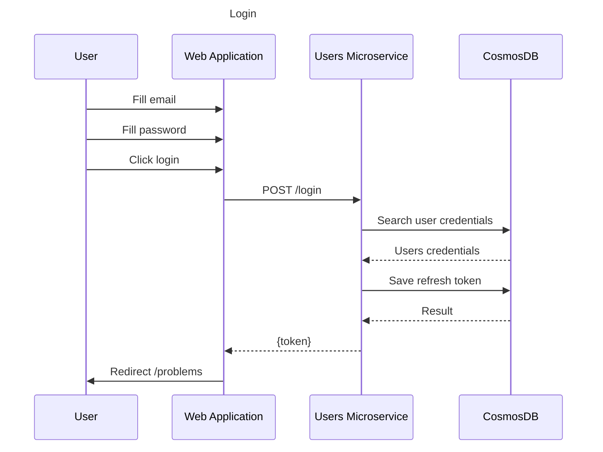
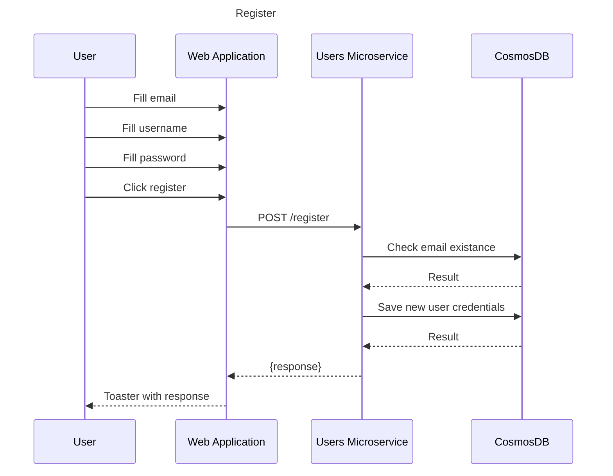
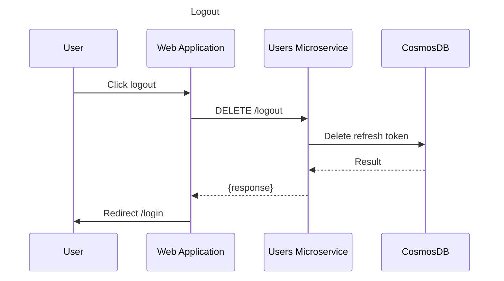
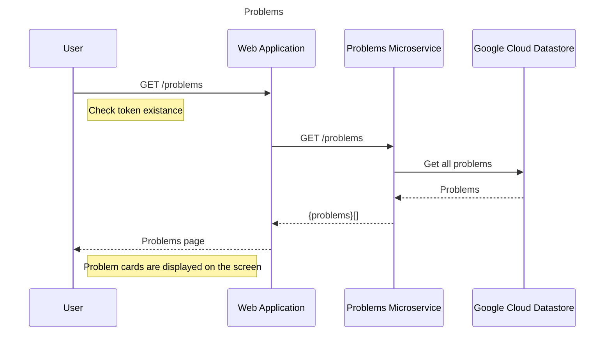
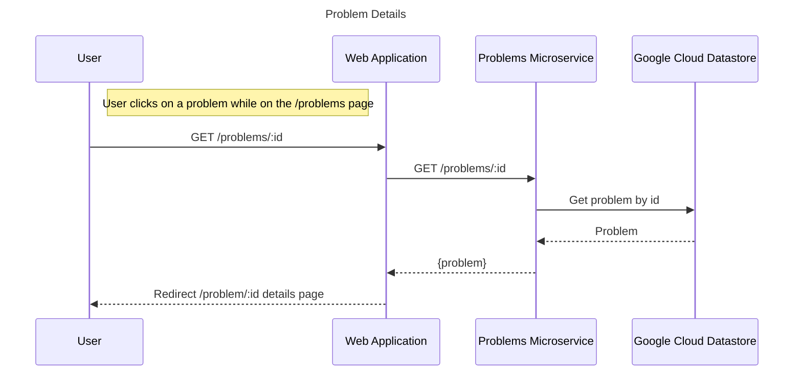
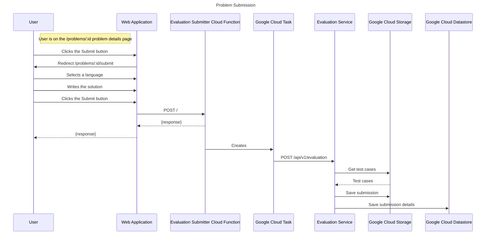
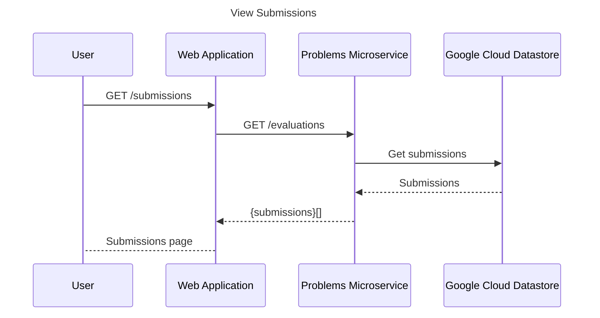
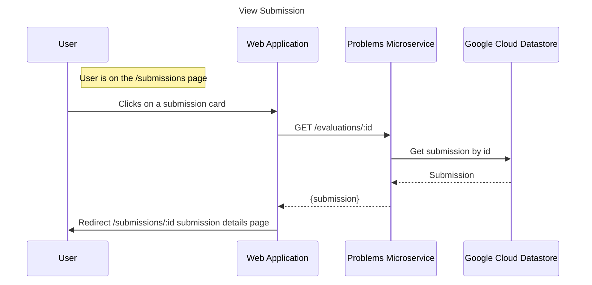

```mermaid
sequenceDiagram
  Title: Login
  User->>Web Application: Fill email
  User->>Web Application: Fill password
  User->>Web Application: Click login
  Web Application ->> Users Microservice: POST /login
  Users Microservice ->> CosmosDB : Search user credentials
  CosmosDB -->> Users Microservice: Users credentials
  
  Users Microservice ->> CosmosDB : Save refresh token
  CosmosDB -->> Users Microservice: Result
  Users Microservice -->> Web Application : {token}
  Web Application ->> User: Redirect /problems
```

```mermaid
sequenceDiagram
  Title: Register
  User->>Web Application: Fill email
  User->>Web Application: Fill username
  User->>Web Application: Fill password
  User->>Web Application: Click register
  Web Application ->> Users Microservice: POST /register
  Users Microservice ->> CosmosDB : Check email existance
  CosmosDB -->> Users Microservice: Result
  
  Users Microservice ->> CosmosDB : Save new user credentials
  CosmosDB -->> Users Microservice: Result
  Users Microservice -->> Web Application : {response}
  Web Application -->> User: Toaster with response
```

```mermaid
sequenceDiagram
  Title: Logout
  User->>Web Application: Click logout
  Web Application ->> Users Microservice: DELETE /logout
  Users Microservice ->> CosmosDB : Delete refresh token
  CosmosDB -->> Users Microservice: Result
  Users Microservice -->> Web Application : {response}
  Web Application ->> User: Redirect /login
```

```mermaid
sequenceDiagram
  Title: Problems
  User->>Web Application: GET /problems
  Note right of User : Check token existance
  Web Application ->> Problems Microservice: GET /problems
  Problems Microservice ->>  Google Cloud Datastore: Get all problems
  Google Cloud Datastore -->> Problems Microservice: Problems
  Problems Microservice -->> Web Application : {problems}[] 
  Web Application -->> User: Problems page
  Note right of User : Problem cards are displayed on the screen
```

```mermaid
sequenceDiagram
  Title: Problem Details
  Note right of User : User clicks on a problem while on the /problems page
  User->>Web Application: GET /problems/:id

  Web Application ->> Problems Microservice: GET /problems/:id
  Problems Microservice ->>  Google Cloud Datastore: Get problem by id
  Google Cloud Datastore -->> Problems Microservice: Problem
  Problems Microservice -->> Web Application : {problem}
  Web Application -->> User: Redirect /problem/:id details page

```

```mermaid
sequenceDiagram
  Title: Problem Submission
  Note right of User : User is on the /problems/:id problem details page
  User->>Web Application: Clicks the Submit button
  Web Application ->> User: Redirect /problems/:id/submit

  User->>Web Application: Selects a language
  User->>Web Application: Writes the solution
  User->>Web Application: Clicks the Submit button
  Web Application ->> Evaluation Submitter Cloud Function: POST /
  Evaluation Submitter Cloud Function -->> Web Application : {response}
  Web Application -->> User : {response}
  Evaluation Submitter Cloud Function ->> Google Cloud Task : Creates
  Google Cloud Task ->> Evaluation Service : POST /api/v1/evaluation
 
  Evaluation Service ->> Google Cloud Storage : Get test cases
  Google Cloud Storage -->> Evaluation Service : Test cases
  Evaluation Service ->> Google Cloud Storage : Save submission
  Evaluation Service ->> Google Cloud Datastore :  Save submission details

```

```mermaid
sequenceDiagram
  Title: View Submissions
  User->>Web Application: GET /submissions
  Web Application ->> Problems Microservice : GET /evaluations
  Problems Microservice ->> Google Cloud Datastore : Get submissions
  Google Cloud Datastore -->> Problems Microservice : Submissions
  
  Problems Microservice -->> Web Application : {submissions}[]
  Web Application --> User : Submissions page

```

```mermaid
sequenceDiagram
  Title: View Submission
  Note right of User : User is on the /submissions page
  User->>Web Application: Clicks on a submission card
  Web Application ->> Problems Microservice : GET /evaluations/:id
  Problems Microservice ->> Google Cloud Datastore : Get submission by id
  Google Cloud Datastore -->> Problems Microservice : Submission
  
  Problems Microservice -->> Web Application : {submission}
  Web Application ->> User : Redirect /submissions/:id submission details page

```

