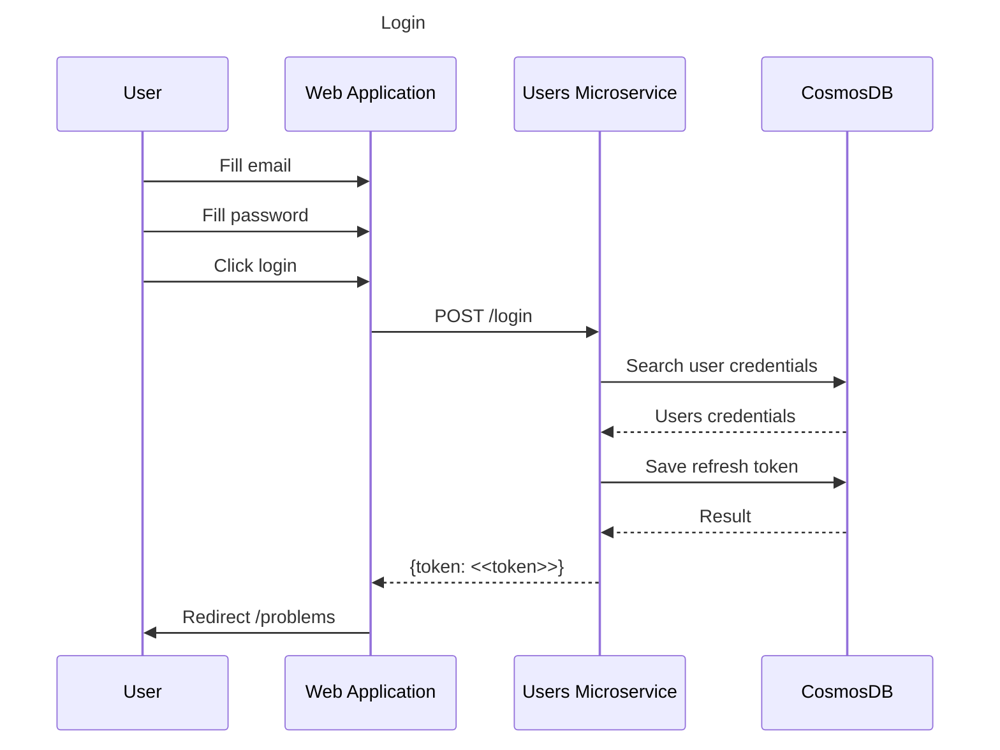
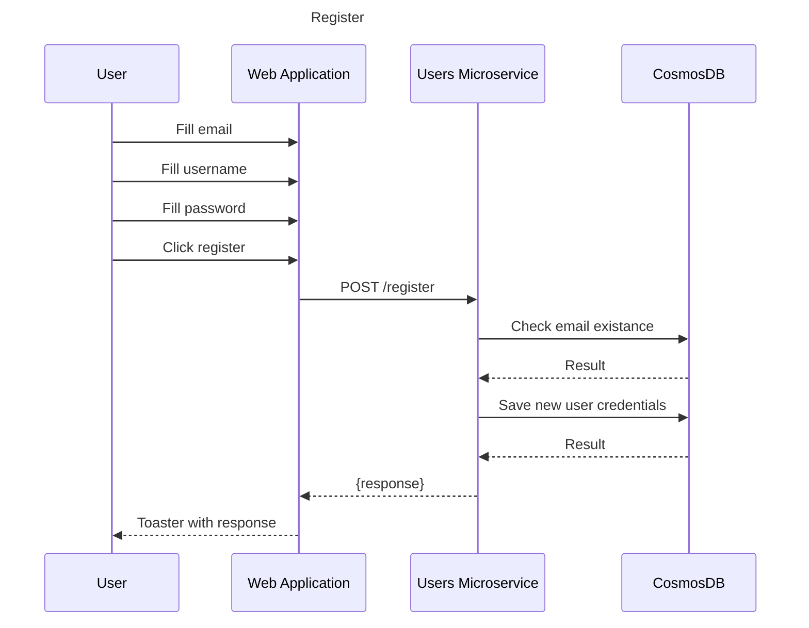
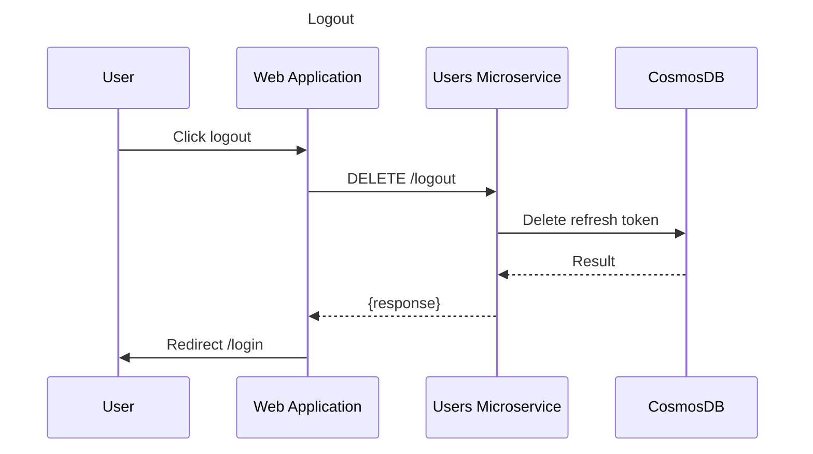

```mermaid
sequenceDiagram
  Title: Login
  User->>Web Application: Fill email
  User->>Web Application: Fill password
  User->>Web Application: Click login
  Web Application ->> Users Microservice: POST /login
  Users Microservice ->> CosmosDB : Search user credentials
  CosmosDB -->> Users Microservice: Users credentials
  
  Users Microservice ->> CosmosDB : Save refresh token
  CosmosDB -->> Users Microservice: Result
  Users Microservice -->> Web Application : {token: <<token>>}
  Web Application ->> User: Redirect /problems
```

```mermaid
sequenceDiagram
  Title: Register
  User->>Web Application: Fill email
  User->>Web Application: Fill username
  User->>Web Application: Fill password
  User->>Web Application: Click register
  Web Application ->> Users Microservice: POST /register
  Users Microservice ->> CosmosDB : Check email existance
  CosmosDB -->> Users Microservice: Result
  
  Users Microservice ->> CosmosDB : Save new user credentials
  CosmosDB -->> Users Microservice: Result
  Users Microservice -->> Web Application : {response}
  Web Application -->> User: Toaster with response
```

```mermaid
sequenceDiagram
  Title: Logout
  User->>Web Application: Click logout
  Web Application ->> Users Microservice: DELETE /logout
  Users Microservice ->> CosmosDB : Delete refresh token
  CosmosDB -->> Users Microservice: Result
  Users Microservice -->> Web Application : {response}
  Web Application ->> User: Redirect /login
```