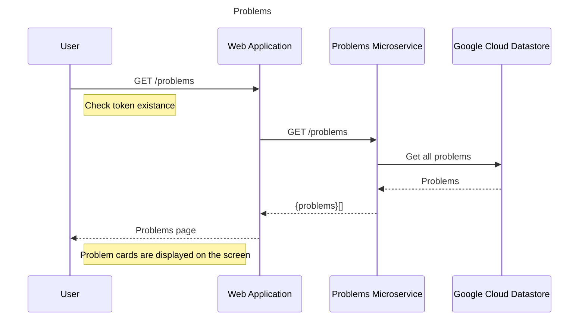
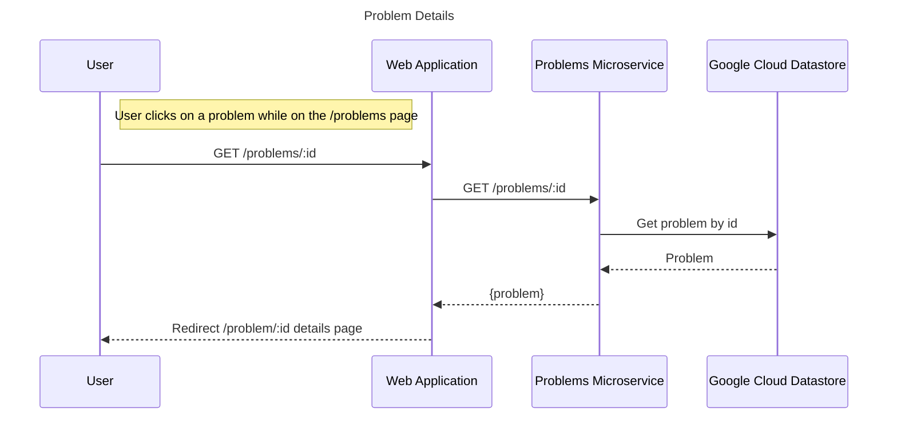

```mermaid
sequenceDiagram
  Title: Problems
  User->>Web Application: GET /problems
  Note right of User : Check token existance
  Web Application ->> Problems Microservice: GET /problems
  Problems Microservice ->>  Google Cloud Datastore: Get all problems
  Google Cloud Datastore -->> Problems Microservice: Problems
  Problems Microservice -->> Web Application : {problems}[] 
  Web Application -->> User: Problems page
  Note right of User : Problem cards are displayed on the screen
```

```mermaid
sequenceDiagram
  Title: Problem Details
  Note right of User : User clicks on a problem while on the /problems page
  User->>Web Application: GET /problems/:id

  Web Application ->> Problems Microservice: GET /problems/:id
  Problems Microservice ->>  Google Cloud Datastore: Get problem by id
  Google Cloud Datastore -->> Problems Microservice: Problem
  Problems Microservice -->> Web Application : {problem}
  Web Application -->> User: Redirect /problem/:id details page

```

