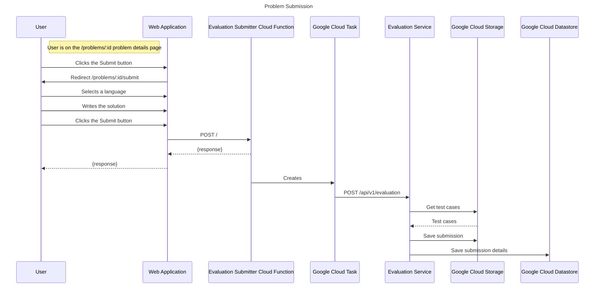
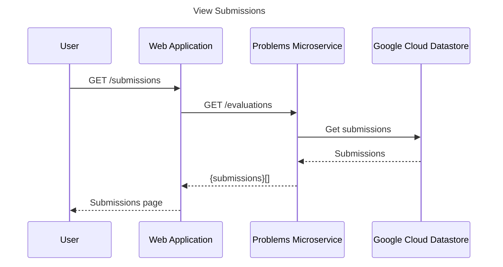
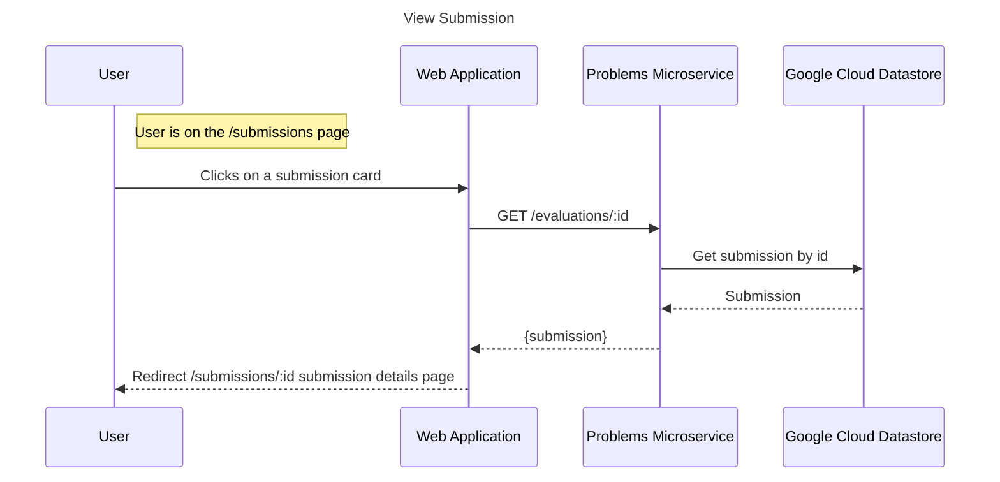

```mermaid
sequenceDiagram
  Title: Problem Submission
  Note right of User : User is on the /problems/:id problem details page
  User->>Web Application: Clicks the Submit button
  Web Application ->> User: Redirect /problems/:id/submit

  User->>Web Application: Selects a language
  User->>Web Application: Writes the solution
  User->>Web Application: Clicks the Submit button
  Web Application ->> Evaluation Submitter Cloud Function: POST /
  Evaluation Submitter Cloud Function -->> Web Application : {response}
  Web Application -->> User : {response}
  Evaluation Submitter Cloud Function ->> Google Cloud Task : Creates
  Google Cloud Task ->> Evaluation Service : POST /api/v1/evaluation
 
  Evaluation Service ->> Google Cloud Storage : Get test cases
  Google Cloud Storage -->> Evaluation Service : Test cases
  Evaluation Service ->> Google Cloud Storage : Save submission
  Evaluation Service ->> Google Cloud Datastore :  Save submission details

```

```mermaid
sequenceDiagram
  Title: View Submissions
  User->>Web Application: GET /submissions
  Web Application ->> Problems Microservice : GET /evaluations
  Problems Microservice ->> Google Cloud Datastore : Get submissions
  Google Cloud Datastore -->> Problems Microservice : Submissions
  
  Problems Microservice -->> Web Application : {submissions}[]
  Web Application -->> User : Submissions page

```

```mermaid
sequenceDiagram
  Title: View Submission
  Note right of User : User is on the /submissions page
  User->>Web Application: Clicks on a submission card
  Web Application ->> Problems Microservice : GET /evaluations/:id
  Problems Microservice ->> Google Cloud Datastore : Get submission by id
  Google Cloud Datastore -->> Problems Microservice : Submission
  
  Problems Microservice -->> Web Application : {submission}
  Web Application -->> User : Redirect /submissions/:id submission details page

```

